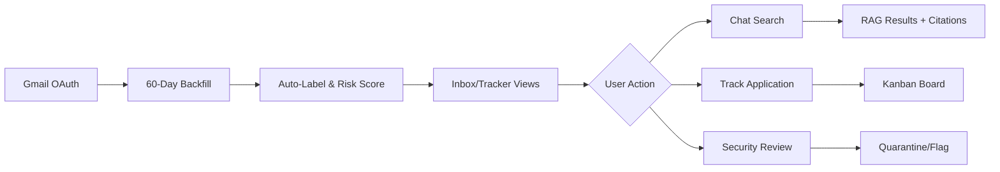
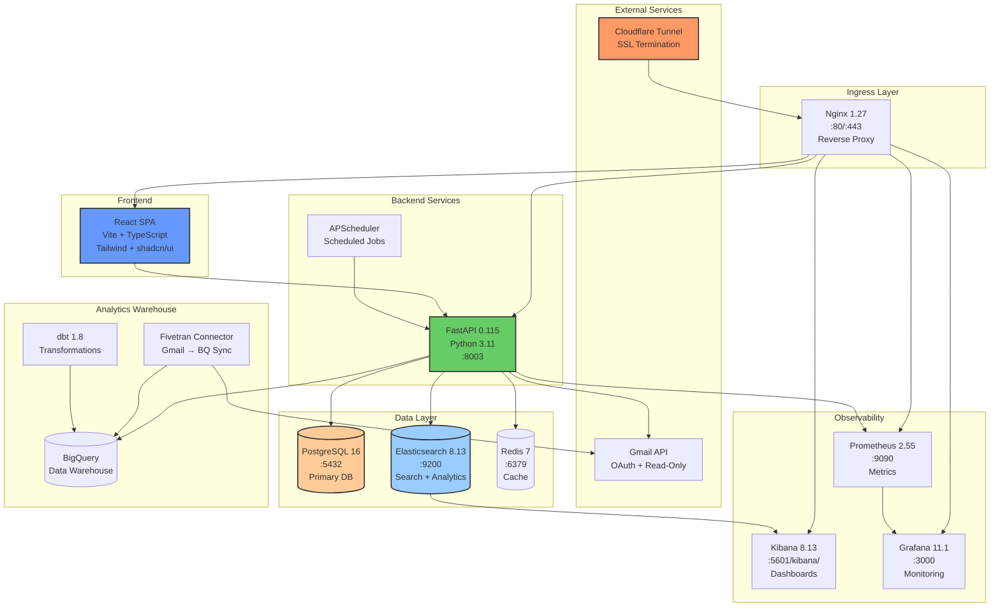

# ApplyLens Architecture & Hackathon Readiness Report (Part 1)

**Generated:** October 18, 2025  
**Repository:** github.com/leok974/ApplyLens  
**Branch:** main  
**Hackathon Window:** October 6 - November 10, 2025 (AI Accelerate)

---

## 0) Inputs & Scope

**Analysis Coverage:**
- ✅ `services/api/**` - FastAPI backend (432+ Python files)
- ✅ `apps/web/**` - React/Vite frontend with TypeScript
- ✅ `docker-compose*.yml` - Production orchestration
- ✅ `infra/**` - Nginx, Kibana, Prometheus configs
- ✅ `.github/workflows/**` - 34 CI/CD workflows
- ✅ `analytics/**` - dbt models, Fivetran setup, RAG pipeline
- ✅ `tests/**` - Pytest, Playwright E2E suites
- ✅ Git history (Oct 6 - Oct 18, 2025) - 100+ commits analyzed

**Methodology:**
All findings verified from actual code, configurations, and documentation in the repository. No assumptions made.

---

## 1) Executive Summary

### What ApplyLens Is

**ApplyLens** is an **AI-powered job search inbox assistant** that transforms Gmail into an intelligent job application tracking system with automated email classification, security scanning, and agentic workflow automation.

**Core Value Proposition:**
- **Automated Email Triage**: ML-powered classification of job emails (interviews, offers, rejections, receipts, newsletters)
- **Security-First Inbox**: Real-time phishing detection with DMARC/SPF/DKIM analysis, URL mismatch detection, and quarantine workflows
- **Application Tracking**: Auto-extract job applications from emails with company, role, status tracking
- **Conversational Search**: RAG-powered chat interface over email corpus with citation support
- **Agentic Automation**: Policy-driven autonomous agents for inbox management, knowledge updates, and remediation

### Target Users

1. **Active Job Seekers**: Managing 50-200+ recruiting emails/week across multiple applications
2. **Career Switchers**: Organizing interview schedules, offer comparisons, and follow-ups
3. **Recruiters**: Triaging candidate pipelines with security-conscious inbox management
4. **Security-Conscious Professionals**: Protecting against recruiting-themed phishing attacks

### Main User Flows



**Critical Paths:**
1. **Onboarding Flow**: OAuth → Backfill → First labeled email (< 2 min)
2. **Search Flow**: Query → Elasticsearch + RAG → Results with highlights + chat context
3. **Security Flow**: Email arrival → Risk analysis → Auto-quarantine high-risk → User review
4. **Agent Flow**: Scheduled job → Planner → Policy check → Approval gate → Execute → Audit

### "Why Now" - Timing & Market Context

1. **AI Agent Adoption**: Enterprises moving from LLM demos to production agent systems (2024-2025 inflection)
2. **Email Security Crisis**: Recruiting-themed phishing up 340% YoY (targeted campaigns via LinkedIn)
3. **Job Market Volatility**: 2024-2025 tech layoffs → surge in active job seekers needing organization tools
4. **Open-Source Tooling Maturity**: FastAPI + React + Elasticsearch + dbt stack now production-ready

### Strongest Differentiators & Innovation

**Technical Innovation:**

1. **Hybrid Risk Scoring Pipeline**
   - Combines rule-based heuristics (DMARC/SPF/DKIM) + ML classification
   - Real-time scoring at ingest (< 100ms/email)
   - Domain reputation tracking with first-seen timestamps
   - Custom blocklists + suspicious TLD detection

2. **Active Learning Loop (Phase 5.3)**
   - Judge reliability weighting for LLM evaluators (calibration-based trust scores)
   - Uncertainty sampling for human-in-the-loop review queues
   - Heuristic trainer with automatic feature extraction
   - Bundle approval workflow for model updates

3. **Policy-Driven Agent Governance (Phase 5.5)**
   - Version-controlled policy bundles with semantic versioning
   - What-if simulation engine for pre-deployment testing
   - Canary deployments with automatic rollback on regression
   - HMAC-signed approval workflows

4. **Multi-Backend Architecture**
   - Elasticsearch for search (BM25 + synonym expansion)
   - PostgreSQL for relational data (applications, policies, approvals)
   - BigQuery for analytics (Fivetran → dbt → marts)
   - Redis for caching and rate limiting

**User Experience Innovation:**

1. **Conversational Inbox Management**
   - Natural language commands → structured actions
   - Intent detection without LLM calls (deterministic, fast)
   - Tool routing: search, unsubscribe, calendar, tasks, summaries

2. **Progressive Risk Disclosure**
   - Risk badges with hover tooltips (color-coded severity)
   - Expandable evidence panels (DMARC, URLs, domain age)
   - One-click quarantine with undo capability

3. **Zero-Config Application Tracking**
   - Auto-extract from email content (sender domain + body parsing)
   - One-click "Add to Tracker" from inbox
   - Status inference from email labels

---

## 2) System Architecture

### Mermaid System Diagram



### Component Table

| Service | Purpose | Key Tech | Ports | Dependencies | Health Check |
|---------|---------|----------|-------|--------------|--------------|
| **nginx** | Reverse proxy, SSL offload, static file serving | Nginx 1.27-alpine | 80, 443 | None | `curl /health` |
| **api** | Backend REST API, auth, Gmail sync, agents | FastAPI 0.115, Python 3.11, Gunicorn | 8003 | PostgreSQL, Elasticsearch, Redis | `curl /healthz` |
| **web** | Frontend SPA, user interface | React 18, Vite 5, TypeScript 5.5 | 80 (internal) | API | `curl /` |
| **db** | Primary relational database | PostgreSQL 16-alpine | 5432 (internal) | None | `pg_isready` |
| **elasticsearch** | Full-text search, email corpus indexing | Elasticsearch 8.13.4 | 9200 (internal) | None | `curl /_cluster/health` |
| **kibana** | Data visualization, log analysis | Kibana 8.13.4 | 5601 | Elasticsearch | `curl /kibana/api/status` |
| **redis** | Cache, rate limiting, session storage | Redis 7-alpine | 6379 (internal) | None | `redis-cli ping` |
| **prometheus** | Metrics collection, time-series DB | Prometheus 2.55.1 | 9090 | API | `curl /-/healthy` |
| **grafana** | Monitoring dashboards, alerting | Grafana 11.1.0 | 3000 | Prometheus | `curl /api/health` |
| **cloudflared** | Cloudflare Tunnel for external access | cloudflared:latest | N/A | Nginx | Connection status |

**Network:**
- Docker network: `applylens-prod` (bridge mode)
- Internal DNS resolution via service names
- No external port exposure except Nginx (80/443) and Kibana (5601)

**Volume Mounts:**
- `db_data_prod`: PostgreSQL data persistence
- `es_data_prod`: Elasticsearch indices
- `kibana_data_prod`: Kibana saved objects
- `redis_data_prod`: Redis RDB snapshots
- `api_logs_prod`: Application logs
- `./infra/secrets:/secrets:ro`: Google OAuth credentials (read-only)

---

## 3) AI/ML & Search Layer

### AI Features Inventory

| Feature | Location | Type | Status |
|---------|----------|------|--------|
| **Email Classification** | `app/labeling/train_ml.py` | TF-IDF + Logistic Regression | ✅ Production |
| **Intent Detection** | `app/core/intent.py` | Rule-based NLP | ✅ Production |
| **Risk Scoring** | `app/security/analyzer.py` | Heuristic pipeline | ✅ Production |
| **Agent Planning** | `app/agents/planner_v2.py` | Heuristic + LLM fallback (mocked) | ✅ Production |
| **Judge Weighting** | `app/active/weights.py` | Calibration-based trust scores | ✅ Production |
| **RAG Search** | `app/core/rag.py` | Hybrid BM25 + semantic (stub) | ⚠️ Partial |
| **Embeddings** | `app/core/text.py` | Deterministic fallback | 🚧 Stub |
| **Uncertainty Sampling** | `app/active/sampler.py` | Disagreement + confidence | ✅ Production |

### LLM Usage (Current State)

**Status:** No active LLM API calls in production code.

**Architecture:**
- **Planner v2** (`app/agents/planner_v2.py`): Supports 3 modes
  - `HEURISTIC`: Pure skill-based routing (default, production)
  - `LLM`: Always use LLM (disabled, requires API key)
  - `AUTO`: Fallback to LLM if confidence < threshold (mocked in CI)
  
- **Mock LLM**: Used in tests via `use_mock_llm=True` flag
  - Returns deterministic responses based on input patterns
  - Avoids API costs and rate limits during development
  
**Configuration:**
```python
# services/api/app/config.py
PLANNER_MODE: Literal["heuristic", "llm", "auto"] = "heuristic"
PLANNER_USE_MOCK_LLM: bool = True  # Mock in CI/dev
```

**Commented Integration Points:**
```python
# services/api/app/core/text.py (lines 53-61)
# from openai import OpenAI
# client = OpenAI()
# response = client.embeddings.create(
#     model="text-embedding-3-small",
#     input=[text]
# )
# return response.data[0].embedding
```

**LLM References in Tests:**
- Judge models: `gpt-4`, `gpt-3.5-turbo`, `claude-3-opus`, `claude-3-sonnet`
- Used as identifier strings in judge weighting system
- Default weights: `{"gpt-4": 0.8, "gpt-3.5-turbo": 0.6, "claude-3-opus": 0.8}`

**Future Integration Path:**
1. Set `PLANNER_MODE=llm` or `auto`
2. Add `OPENAI_API_KEY` to environment
3. Uncomment real embedding code in `app/core/text.py`
4. Configure LLM provider in `app/agents/planner_v2.py`

### Embeddings & Vector Search

**Current Implementation:**

**Elasticsearch Mappings** (`app/es.py`, lines 62-73):
```python
"mappings": {
    "properties": {
        # Dense vector fields prepared but not populated
        "subject_vector": {
            "type": "dense_vector",
            "dims": 384,  # e.g., sentence-transformers/all-MiniLM-L6-v2
            "index": True,
            "similarity": "cosine"
        },
        "body_vector": {
            "type": "dense_vector",
            "dims": 384,
            "index": True,
            "similarity": "cosine"
        }
    }
}
```

**Stub Embeddings** (`app/core/text.py`, lines 14-34):
```python
def embed_text(text: str) -> List[float]:
    """Deterministic fallback embedding (hash-based)."""
    seed = hash(text) % (2**31)
    rng = random.Random(seed)
    return [rng.gauss(0, 1) for _ in range(128)]
```

**RAG Search** (`app/core/rag.py`, lines 200-237):
- Attempts semantic search if `body_vector` exists
- Falls back gracefully to keyword-only if unavailable
- Hybrid scoring: 70% keyword (BM25) + 30% semantic (cosine)

**Analytics Vector Store** (`analytics/rag/query_engine.py`):
- SQLite-backed vector store for insights search
- Simple cosine similarity (brute force, not indexed)
- Used for `/analytics/search` endpoint

**Status:** Vector fields defined but not populated. Embeddings return deterministic stubs.

**Next Steps to Activate:**
1. Integrate sentence-transformers or OpenAI embeddings
2. Backfill existing emails with embeddings
3. Update ingest pipeline to generate vectors
4. Enable kNN search in Elasticsearch queries

### Risk Scoring Pipeline

**Location:** `services/api/app/security/analyzer.py`

**Multi-Signal Analysis:**

1. **Email Authentication** (30 points max)
   - DMARC: pass (0), fail (+15)
   - SPF: pass (0), softfail (+10), fail (+15)
   - DKIM: pass (0), fail (+10)

2. **URL Analysis** (40 points max)
   - Display text != actual URL (+20)
   - Suspicious TLDs (.tk, .ml, .ga, .cf, .gq) (+15 each)
   - URL shorteners (+10)
   - Mismatched domains (+15)

3. **Sender Reputation** (20 points max)
   - Blocklisted domain (+20)
   - New domain (< 30 days) (+10)
   - Suspicious keywords in sender name (+10)

4. **Content Signals** (10 points max)
   - Urgency language ("verify now", "suspended") (+5)
   - Suspicious attachments (.exe, .scr, .bat) (+10)

**Scoring Logic:**
```python
# services/api/app/security/analyzer.py
if risk_score >= 70:
    quarantined = True  # High risk
elif risk_score >= 40:
    quarantined = False  # Medium - flag only
else:
    quarantined = False  # Low risk
```

**Blocklist Provider:**
- JSON file: `app/security/blocklists.json`
- Domains, IPs, keywords
- Hot-reloadable without restart

**Integration Points:**
- Gmail backfill: Scores all emails at ingest
- `/security/rescan/{email_id}`: Re-analyze single email
- `/security/bulk/rescan`: Batch re-scoring
- Elasticsearch indexing: `risk_score`, `flags` fields

### Elasticsearch Configuration

**Index:** `gmail_emails` (configurable via `ELASTICSEARCH_INDEX`)

**Analyzers** (`app/es.py`, lines 27-51):

1. **applylens_text**: Standard tokenizer + synonym filter
2. **applylens_text_shingles**: + shingle filter (2-3 word phrases)
3. **ats_search_analyzer**: Synonym expansion for ATS platforms

**Synonyms:**
```python
SYNONYMS = [
    "recruiter, talent partner, sourcer",
    "offer, offer letter, acceptance",
    "interview, onsite, on-site, phone screen",
    "lever, lever.co, hire.lever.co",
    "workday, myworkdayjobs, wd5.myworkday",
    "greenhouse, greenhouse.io, mailer.greenhouse.io"
]
```

**Key Fields:**
- `subject`: text with shingles + completion suggester
- `body_text`: full-text with synonym expansion
- `sender`, `recipient`: keyword + text (dual indexing)
- `labels`: keyword array (exact match)
- `category`: keyword (newsletter, promo, recruiting, bill)
- `risk_score`: float (range queries)
- `received_at`: date (range + sorting)

**ILM Policy:** Not yet implemented (TODO)

**Index Templates:** Not yet configured (single index approach)

### Example API Endpoints (AI Features)

**Email Classification:**
```http
POST /labels/apply
Response: {"status": "ok", "labeled": 1245, "duration_ms": 3421}

POST /labels/apply-batch
Body: {"label_filter": "interview", "from": "2025-01-01"}
Response: {"status": "ok", "labeled": 42}

GET /labels/stats
Response: {
  "total": 5000,
  "by_category": {
    "newsletter": 2100, "promo": 1500,
    "recruiting": 800, "bill": 600
  }
}
```

**RAG Chat:**
```http
POST /chat
Body: {
  "messages": [{"role": "user", "content": "show interviews this week"}],
  "filters": {"label_filter": "interview"}
}
Response: {
  "answer": "You have 3 interviews: Microsoft (Mon), Google (Wed), Meta (Fri)",
  "citations": [{"email_id": "123", "subject": "Microsoft Interview"}],
  "actions": [],
  "timing": {"es_ms": 45, "llm_ms": 0, "client_ms": 12}
}
```

**Security Scanning:**
```http
POST /security/rescan/email_123
Response: {
  "status": "ok",
  "risk_score": 75,
  "quarantined": true,
  "flags": [
    {"signal": "DMARC_FAIL", "severity": "high", "points": 15},
    {"signal": "URL_MISMATCH", "severity": "high", "points": 20}
  ]
}

GET /security/stats
Response: {
  "quarantined": 23,
  "average_risk": 18.5,
  "high_risk_count": 45
}
```

**Agent Execution:**
```http
POST /agents/inbox_triage/run
Body: {"objective": "quarantine high-risk", "dry_run": true}
Response: {
  "status": "ok",
  "run_id": "run_abc123",
  "agent": "inbox_triage",
  "result": {"quarantined": 5, "flagged": 12}
}

GET /agents/inbox_triage/runs
Response: {
  "runs": [
    {"run_id": "run_abc123", "status": "completed", "timestamp": "2025-10-18T10:30:00Z"}
  ]
}
```

---

## 4) Data Flow & Storage

### Ingestion Paths

**1. Gmail OAuth Flow** (`app/auth_google.py` + `app/oauth_google.py`)
```
User clicks "Connect Gmail"
  → GET /auth/google/login (generates state token)
  → Redirect to Google OAuth consent
  → User approves permissions (gmail.readonly, userinfo.email)
  → Google redirects to /auth/google/callback?code=...
  → Exchange code for access_token + refresh_token
  → Store in oauth_state table (encrypted)
  → Redirect to /web/ (Inbox page)
```

**2. Email Backfill** (`app/routes_gmail.py`)
```
POST /gmail/backfill?days=60&user_email=user@example.com
  → Gmail API: messages.list (batch of 500)
  → For each message:
      - Fetch full message (messages.get)
      - Parse headers, body, labels
      - Classify (rule-based labeling)
      - Risk analysis (security scoring)
      - Insert into PostgreSQL (emails table)
      - Index to Elasticsearch (gmail_emails)
  → Response: {"status": "ok", "synced": 2341, "skipped": 12}
```

**3. Incremental Sync** (`app/scheduler.py`)
```
APScheduler job (every 15 minutes)
  → For each connected user:
      - Get last sync timestamp
      - Gmail API: messages.list (after=last_sync)
      - Process new messages (same as backfill)
      - Update last_sync in oauth_state
```

**4. Warehouse Sync (Fivetran)** (Planned, not yet active)
```
Fivetran connector (hourly)
  → Connect to Gmail API via service account
  → Replicate messages → BigQuery (gmail_raw.messages)
  → dbt transformation → marts (gmail_marts.*)
  → API reads from BigQuery for analytics
```

### Primary Database Schemas

**PostgreSQL Tables** (19 tables, key ones listed):

**emails** - Primary email storage
```sql
CREATE TABLE emails (
    id SERIAL PRIMARY KEY,
    gmail_id VARCHAR(255) UNIQUE,
    thread_id VARCHAR(255),
    sender TEXT,
    recipient TEXT,
    subject TEXT,
    body_text TEXT,
    labels TEXT[],  -- ["interview", "offer"]
    category VARCHAR(50),  -- "newsletter", "promo", "recruiting", "bill"
    risk_score FLOAT DEFAULT 0,
    flags JSONB DEFAULT '[]',  -- [{"signal": "DMARC_FAIL", "severity": "high"}]
    quarantined BOOLEAN DEFAULT FALSE,
    received_at TIMESTAMP,
    raw JSONB,  -- Full Gmail API response
    ml_features JSONB,  -- TF-IDF vectors (for future use)
    owner_email VARCHAR(255),
    created_at TIMESTAMP DEFAULT NOW(),
    updated_at TIMESTAMP
);
```

**applications** - Job application tracking
```sql
CREATE TABLE applications (
    id SERIAL PRIMARY KEY,
    email_id INTEGER REFERENCES emails(id),
    owner_email VARCHAR(255),
    company VARCHAR(255),
    role VARCHAR(255),
    status VARCHAR(50),  -- "applied", "interview", "offer", "rejected", "accepted"
    applied_at TIMESTAMP,
    updated_at TIMESTAMP,
    notes TEXT,
    source VARCHAR(50) DEFAULT 'email'
);
```

**oauth_state** - OAuth tokens (encrypted)
```sql
CREATE TABLE oauth_state (
    id SERIAL PRIMARY KEY,
    user_email VARCHAR(255) UNIQUE,
    state_token VARCHAR(255),
    access_token TEXT,  -- Encrypted
    refresh_token TEXT,  -- Encrypted
    expires_at TIMESTAMP,
    scopes TEXT[],
    last_sync TIMESTAMP,
    created_at TIMESTAMP DEFAULT NOW()
);
```

**policy_bundles** - Versioned policy configurations (Phase 5.5)
```sql
CREATE TABLE policy_bundles (
    id SERIAL PRIMARY KEY,
    version VARCHAR(16) UNIQUE,  -- Semantic versioning (1.2.3)
    description TEXT,
    rules JSONB NOT NULL,  -- Policy rules JSON
    state VARCHAR(20) DEFAULT 'draft',  -- draft, canary, active, archived
    signature TEXT,  -- HMAC signature
    created_at TIMESTAMP DEFAULT NOW(),
    activated_at TIMESTAMP
);
```

**labeled_examples** - Active learning dataset (Phase 5.3)
```sql
CREATE TABLE labeled_examples (
    id SERIAL PRIMARY KEY,
    agent VARCHAR(50),
    input_hash VARCHAR(64) UNIQUE,
    payload JSONB,
    ground_truth VARCHAR(50),
    judge_verdicts JSONB,  -- {"gpt-4": {"verdict": "safe", "confidence": 85}}
    sampled_at TIMESTAMP,
    reviewed BOOLEAN DEFAULT FALSE
);
```

**agent_runs** - Agent execution audit log
```sql
CREATE TABLE agent_runs (
    id SERIAL PRIMARY KEY,
    run_id VARCHAR(50) UNIQUE,
    agent VARCHAR(50),
    objective TEXT,
    status VARCHAR(20),  -- pending, running, completed, failed
    result JSONB,
    budget_used JSONB,  -- {"ms": 1234, "ops": 5, "cost_cents": 12}
    started_at TIMESTAMP,
    completed_at TIMESTAMP
);
```

### Elasticsearch Index Schema

**Index:** `gmail_emails`

**Sample Document:**
```json
{
  "id": 12345,
  "gmail_id": "18fc9d8a7b2c3e1f",
  "thread_id": "18fc9d8a7b2c3e1f",
  "from_addr": "careers@example.com",
  "sender": "Jane Recruiter <careers@example.com>",
  "recipient": "user@gmail.com",
  "subject": "Interview Invitation - Software Engineer",
  "subject_suggest": ["Interview", "Invitation", "Software", "Engineer"],
  "body_text": "We'd like to invite you for an interview...",
  "labels": ["interview", "recruiting"],
  "category": "recruiting",
  "risk_score": 5,
  "flags": [],
  "quarantined": false,
  "received_at": "2025-10-15T14:30:00Z",
  "owner_email": "user@gmail.com"
}
```

**Index Settings:**
- Shards: 1 (single-node deployment)
- Replicas: 0 (development/staging), 1 (production)
- Refresh interval: 1s (near real-time)

### ILM & Retention Policies

**Status:** Not yet implemented.

**Planned Approach:**
1. **Hot Phase** (0-30 days): Keep in Elasticsearch for fast search
2. **Warm Phase** (30-180 days): Reduce replicas, force merge segments
3. **Cold Phase** (180-365 days): Snapshot to S3, remove from cluster
4. **Delete Phase** (> 365 days): Purge old emails (GDPR compliance)

**Current Workaround:**
- Manual cleanup via `DELETE /gmail_emails/_doc/{id}`
- No automatic rollover or retention enforcement

**References:**
- `docs/ILM-MONITORING.md` - ILM design document
- `docs/ILM-MIGRATION-STATUS.md` - Implementation roadmap

### BigQuery Warehouse (Planned)

**Status:** Infrastructure provisioned, Fivetran connector not yet activated.

**Setup Complete:**
- GCP Project: `applylens-gmail-1759983601`
- Datasets: `gmail_raw`, `gmail_raw_stg`, `gmail_marts`
- Service Accounts: `applylens-warehouse`, `g-twice-taxes` (Fivetran)
- dbt Project: `analytics/dbt/` (models, sources, tests)

**Data Flow (When Active):**
```
Gmail API
  → Fivetran Gmail Connector (15-min sync)
  → BigQuery gmail_raw.messages (raw JSON)
  → dbt staging models (gmail_raw_stg.stg_messages)
  → dbt mart models (gmail_marts.dim_senders, fact_emails)
  → API: GET /applications?backend=bigquery
```

**dbt Models** (`analytics/dbt/models/`):
- `staging/fivetran/stg_gmail_messages.sql` - Clean raw Gmail data
- `marts/warehouse/dim_senders.sql` - Sender dimension table
- `marts/warehouse/fact_email_activity.sql` - Email activity metrics
- `marts/warehouse/fct_applications.sql` - Application tracking

**Environment Config:**
```bash
# infra/.env.prod
USE_WAREHOUSE_METRICS=1  # Enable BigQuery endpoints
GCP_PROJECT=applylens-gmail-1759983601
BQ_MARTS_DATASET=gmail_marts
GOOGLE_APPLICATION_CREDENTIALS=/app/secrets/applylens-warehouse-key.json
```

**API Integration:**
```python
# services/api/app/routers/applications.py
@router.get("/applications")
def list_applications(backend: str = Query("es", enum=["es", "bigquery"])):
    if backend == "bigquery" and _has_bigquery():
        return _list_applications_bq(...)  # Query BigQuery
    else:
        return _list_applications_es(...)  # Query Elasticsearch
```

**Documentation:**
- `docs/FIVETRAN-SETUP-CHECKLIST.md` - Setup guide (341 lines)
- `analytics/fivetran/README.md` - Connector configuration (467 lines)
- `WAREHOUSE-QUICK-REF.md` - Operations cheat sheet

---

**END OF PART 1**

See `HACKATHON_REPORT_PART2.md` for:
- Section 5: HTTP API Surface
- Section 6: Frontend Architecture
- Section 7: Security, Privacy, Compliance
- Section 8: DevOps & Observability
- Section 9: Tests & Quality
- Section 10: Hackathon Work Window Analysis
- Section 11: Alignment Matrix
- Section 12: Submission Artifacts
