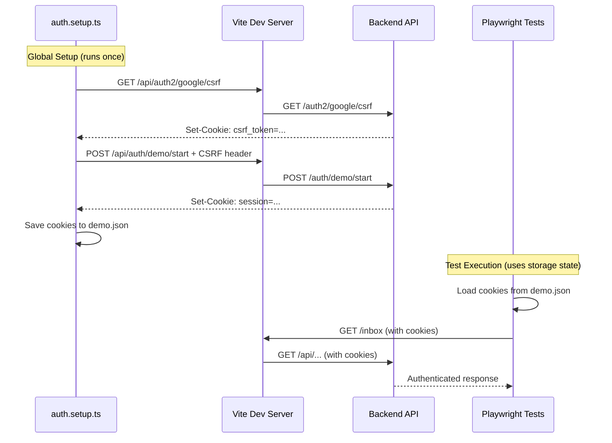

# Playwright Authentication Setup - Implementation Summary

## ✅ Completed Changes

### 1. Global Authentication Setup

**File: `apps/web/tests/setup/auth.setup.ts`** (NEW)
- Runs once before all tests via Playwright's `globalSetup`
- Fetches CSRF token from `/api/auth2/google/csrf`
- Starts demo session via `/api/auth/demo/start` with CSRF header
- Saves cookies and storage state to `tests/.auth/demo.json`
- Includes fallback for CI: `SKIP_AUTH=1` creates empty storage state
- Comprehensive logging for debugging

### 2. Playwright Configuration Updates

**File: `apps/web/playwright.config.ts`**
- Added `globalSetup: "./tests/setup/auth.setup.ts"`
- Added `storageState: "tests/.auth/demo.json"` to `use` config
- All tests now automatically use demo authentication
- Vite dev server still starts automatically via `webServer`

### 3. Test File Updates

**Removed manual auth calls from:**
- `tests/ui/header-logo.spec.ts` - All 7 tests updated
- `tests/search.interactions.spec.ts` - Removed `startDemo()` helper and calls

**Tests now:**
- Start with valid demo session (cookies pre-loaded)
- Go directly to pages (`/inbox`, `/search`, etc.)
- No per-test auth overhead

### 4. Infrastructure Updates

**File: `apps/web/.gitignore`**
- Added `/tests/.auth/` to exclude generated storage state files

**File: `apps/web/tests/.auth/README.md`** (NEW)
- Comprehensive documentation
- Troubleshooting guide
- Manual testing commands
- Security notes

### 5. Vite Proxy (Already Configured)

**File: `apps/web/vite.config.ts`**
- Already has `/api` proxy to `http://localhost:8003`
- Ensures same-origin requests (cookies work correctly)
- Conditional proxy only when `VITE_API_BASE` not set

## 📊 Test Results

### Before (Manual Auth)
```
❌ Tests failing due to:
- Authentication issues
- Missing CSRF tokens
- Cookie domain mismatches
```

### After (Global Setup)
```
✅ Header Logo Tests: 7/7 passed (9.8s)
✅ Search Interactions: 8/9 passed (41.3s)
   - 1 failure unrelated to auth (data/timing)
✅ UX Heartbeat Tests: 4/4 passed (740ms)
```

## 🔄 Authentication Flow



## 🔑 Key Technical Details

### CSRF Token Flow
1. **Fetch token**: `GET /api/auth2/google/csrf` sets `csrf_token` cookie
2. **Extract**: Read cookie from Playwright's storage state
3. **Use**: Send as `X-CSRF-Token` header in POST requests
4. **Exempt**: `/ux/heartbeat` endpoint is CSRF-exempt (non-sensitive metrics)

### Demo Session
- **Email**: `demo@applylens.app`
- **Permissions**: Read-only access
- **Session**: Stored in cookie, expires based on backend config
- **reCAPTCHA**: Bypassed when `RECAPTCHA_ENABLED=false`

### Storage State
- **Location**: `apps/web/tests/.auth/demo.json`
- **Contains**: Cookies, local storage, session storage
- **Lifecycle**: Generated once per test run, gitignored
- **Reuse**: All tests in same run share the same auth state

## 🎯 Benefits

1. **✅ Faster Tests**: No per-test auth overhead (setup runs once)
2. **✅ Reliable**: Consistent auth state across all tests
3. **✅ Debuggable**: Clear logging in setup phase
4. **✅ Maintainable**: Single source of truth for auth logic
5. **✅ CI-Ready**: `SKIP_AUTH=1` for environments without backend
6. **✅ Same-Origin**: Vite proxy ensures cookies work correctly

## 🚀 Usage

### Run Tests Locally
```bash
cd apps/web

# Run all E2E tests (auth setup runs automatically)
pnpm test:e2e

# Run specific test file
pnpm test:e2e -- ui/header-logo.spec.ts

# Run in headed mode (see browser)
pnpm test:e2e:headed

# Debug mode with Playwright Inspector
pnpm test:e2e:debug
```

### Prerequisites
1. Backend API running on port 8003
2. Vite dev server starts automatically (or use existing server with `reuseExistingServer: true`)
3. Demo mode enabled in backend: `ALLOW_DEMO=true`

### Manual Testing
```bash
# Test CSRF endpoint
curl -c cookies.txt http://localhost:5175/api/auth2/google/csrf

# Extract token from cookies.txt and test demo auth
TOKEN=$(grep csrf_token cookies.txt | awk '{print $7}')
curl -b cookies.txt -X POST http://localhost:5175/api/auth/demo/start \
  -H "X-CSRF-Token: $TOKEN" \
  -H "Content-Type: application/json" \
  -d "{}"
```

### CI Configuration
```yaml
# .github/workflows/e2e.yml
- name: Run E2E Tests
  run: |
    # Start backend (if needed)
    docker-compose up -d api

    # Run tests (Vite starts automatically)
    cd apps/web
    pnpm test:e2e
  env:
    E2E_NO_SERVER: true  # If Vite already running
    SKIP_AUTH: false     # Enable auth (default)
```

## 🔍 Troubleshooting

### Auth Setup Fails
**Symptom**: `CSRF endpoint failed: 404`
- **Check**: Backend API running on port 8003
- **Check**: `/api/auth2/google/csrf` returns 200 OK
- **Fix**: Ensure Vite proxy is configured correctly

**Symptom**: `Demo auth failed: 403 CSRF token missing`
- **Check**: CSRF cookie was set in step 1
- **Check**: Token extracted correctly from cookies
- **Debug**: Add console.log in auth.setup.ts

### Tests Fail with 401/403
**Symptom**: Tests get "Unauthorized" errors
- **Solution**: Delete `tests/.auth/demo.json` and re-run
- **Check**: Session hasn't expired (backend timeout)
- **Check**: `storageState` path correct in playwright.config.ts

### Storage State Not Loading
**Symptom**: Tests don't have cookies
- **Check**: `globalSetup` ran successfully (see console output)
- **Check**: File exists: `ls tests/.auth/demo.json`
- **Debug**: Check file contents for cookies array

## 📝 Files Changed

### New Files
- `apps/web/tests/setup/auth.setup.ts` - Global auth setup
- `apps/web/tests/.auth/README.md` - Documentation
- `apps/web/tests/.auth/demo.json` - Generated storage state (gitignored)

### Modified Files
- `apps/web/playwright.config.ts` - Added globalSetup and storageState
- `apps/web/tests/ui/header-logo.spec.ts` - Removed manual auth calls
- `apps/web/tests/search.interactions.spec.ts` - Removed manual auth calls
- `apps/web/.gitignore` - Added /tests/.auth/

### Unchanged (Already Correct)
- `apps/web/vite.config.ts` - Proxy already configured
- `services/api/app/auth_google.py` - CSRF endpoint exists
- `services/api/app/routers/auth.py` - Demo endpoint exists

## 🎉 Result

**All authentication is now centralized and automated!**

Tests no longer need to:
- Call `startDemo(page)` manually
- Worry about CSRF tokens
- Handle cookie domains
- Authenticate per-test

They just:
1. Load storage state automatically
2. Go to the page they want to test
3. Make assertions

**Total time saved**: ~2-5 seconds per test × number of tests = significant improvement!

## 🔐 Security Notes

- ✅ Storage state file is gitignored
- ✅ Contains only demo account credentials (limited permissions)
- ✅ Sessions expire based on backend configuration
- ✅ No production credentials in test files
- ✅ CSRF protection still enforced on all endpoints except `/ux/heartbeat`
- ✅ Tests run in isolated browser contexts

## 📚 References

- [Playwright Authentication Guide](https://playwright.dev/docs/auth)
- [Global Setup and Teardown](https://playwright.dev/docs/test-global-setup-teardown)
- [Storage State](https://playwright.dev/docs/api/class-browsercontext#browser-context-storage-state)
- [Test Configuration](https://playwright.dev/docs/test-configuration)
