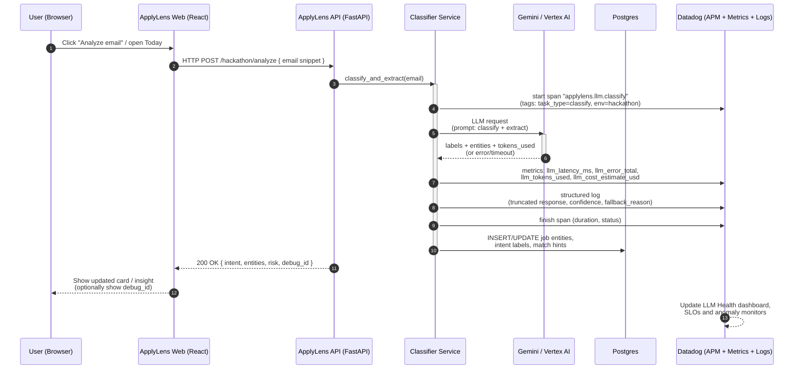
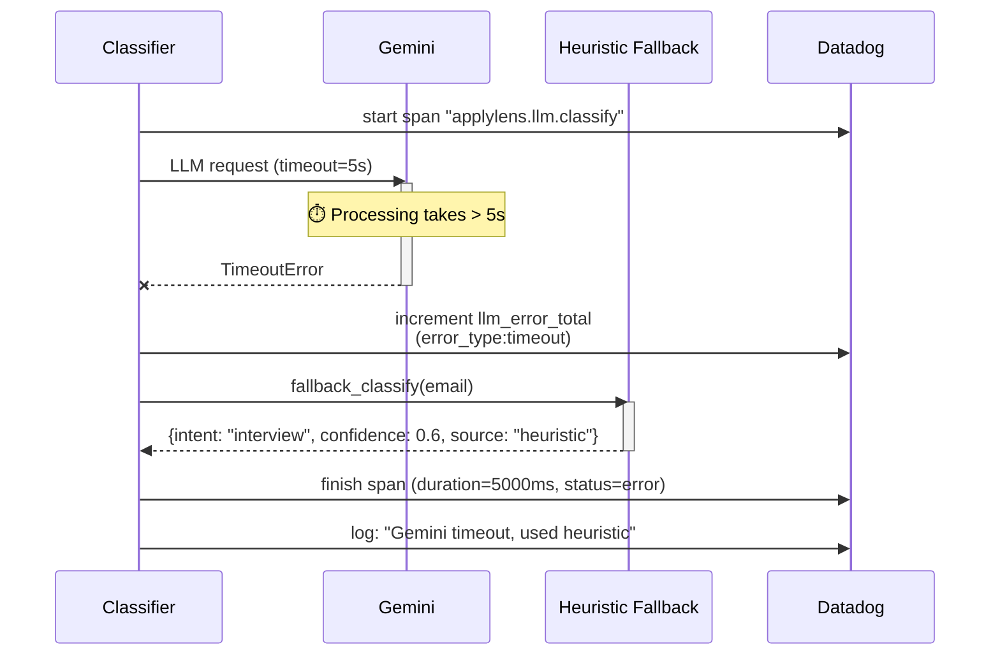
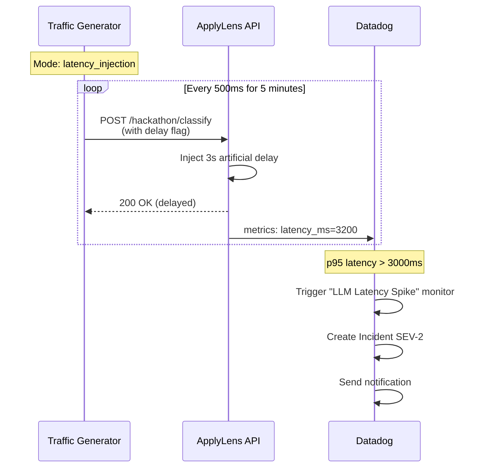

# ApplyLens Observability Copilot – System Flow Diagram

This document provides a detailed sequence diagram showing how email analysis flows through the system with Gemini AI integration and Datadog observability.

---

## End-to-End Email Analysis Flow



---

## Flow Breakdown

### Step 1-2: User Initiates Analysis
**Trigger Points:**
- User opens **Today** view (`/v2/agent/today`)
- User clicks **Analyze** on inbox email
- Developer tests via **Hackathon demo endpoint** (`/hackathon/analyze`)

**Request Example:**
```http
POST /hackathon/analyze HTTP/1.1
Content-Type: application/json

{
  "subject": "Interview Invitation - Senior Engineer",
  "from_email": "recruiter@company.com",
  "body_snippet": "We'd like to schedule a technical interview..."
}
```

---

### Step 3: Datadog APM Span Initiated
**Location:** `app/observability/datadog.py` → `@instrument_llm_call` decorator

**What Happens:**
```python
# Span created with resource name
span = tracer.trace(
    "applylens.llm.classify",
    service="applylens-api-hackathon",
    resource="gemini_classify_email"
)

# Tags attached
span.set_tag("task_type", "classify")
span.set_tag("env", "hackathon")
span.set_tag("model_provider", "gemini")
span.set_tag("model_name", "gemini-1.5-flash")
```

**Why This Matters:**
- Creates distributed trace visible in Datadog APM
- Links LLM call to parent HTTP request
- Enables drill-down from dashboard to specific slow requests

---

### Step 4-5: Gemini LLM Invocation
**Location:** `app/llm/gemini_client.py` → `GeminiLLMClient.classify_email_intent()`

**Request to Gemini:**
```python
prompt = f"""
Classify this email into one of: job_application, interview, offer, rejection, other.

Subject: {subject}
From: {from_email}
Body: {body_snippet}

Return JSON: {{"intent": "...", "confidence": 0.0-1.0}}
"""

response = await asyncio.wait_for(
    model.generate_content_async(prompt),
    timeout=5.0  # ⏱️ 5-second timeout
)
```

**Possible Outcomes:**
1. ✅ **Success** (< 5s) → Parse JSON response
2. ⏱️ **Timeout** (≥ 5s) → Fallback to heuristic classifier
3. ❌ **Error** (API failure) → Fallback to heuristic classifier
4. 🔧 **Invalid JSON** → Fallback to heuristic classifier

**Fallback Heuristic Example:**
```python
# If Gemini fails, use keyword matching
if "interview" in subject.lower():
    return {"intent": "interview", "confidence": 0.6, "source": "heuristic"}
elif "offer" in subject.lower():
    return {"intent": "offer", "confidence": 0.6, "source": "heuristic"}
```

---

### Step 6: Observability Data Emission
**Location:** `app/observability/datadog.py` → `instrument_llm_call` decorator cleanup

**Metrics Emitted:**
```python
from datadog import statsd

# 1. Latency histogram
statsd.histogram(
    "applylens.llm.latency_ms",
    duration_ms,
    tags=["env:hackathon", "task_type:classify", "model:gemini-1.5-flash"]
)

# 2. Error counter (if failed)
if error:
    statsd.increment(
        "applylens.llm.error_total",
        tags=["env:hackathon", "error_type:timeout"]
    )

# 3. Token usage gauge
statsd.gauge(
    "applylens.llm.tokens_used",
    tokens_estimate,
    tags=["env:hackathon", "task_type:classify"]
)

# 4. Cost estimate gauge
statsd.gauge(
    "applylens.llm.cost_estimate_usd",
    cost_estimate,
    tags=["env:hackathon"]
)
```

**Structured Log Example:**
```json
{
  "timestamp": "2024-11-25T10:15:30Z",
  "level": "INFO",
  "logger": "applylens.llm.gemini",
  "message": "LLM classification completed",
  "task_type": "classify",
  "duration_ms": 1250,
  "model": "gemini-1.5-flash",
  "tokens_used": 150,
  "cost_usd": 0.00001125,
  "intent": "interview",
  "confidence": 0.95,
  "fallback_used": false,
  "env": "hackathon",
  "dd.trace_id": "1234567890",
  "dd.span_id": "9876543210"
}
```

**What Gets Logged:**
- ✅ Intent classification result
- ✅ Confidence score
- ✅ Latency and token count
- ✅ Whether fallback was used
- ❌ **NOT logged:** Full email body (PII protection)
- ❌ **NOT logged:** Raw LLM response (privacy)

---

### Step 7: Data Persistence
**Location:** `app/routers/hackathon_demo.py` or production email pipeline

**Database Updates:**
```sql
-- 1. Update email intent label
UPDATE emails
SET intent = 'interview',
    intent_confidence = 0.95,
    intent_source = 'gemini',
    analyzed_at = NOW()
WHERE id = 'email_123';

-- 2. Insert extracted entities (if extraction also ran)
INSERT INTO job_opportunities (
    company_name,
    role_title,
    recruiter_email,
    salary_range,
    source_email_id
) VALUES (
    'Acme Corp',
    'Senior Engineer',
    'recruiter@acmecorp.com',
    '$120k-$150k',
    'email_123'
);

-- 3. Create opportunity match (if user has matching preferences)
INSERT INTO opportunity_matches (
    user_id,
    opportunity_id,
    match_score,
    match_reason
) VALUES (
    'user@example.com',
    'opp_456',
    0.87,
    'Skills: Python, React | Seniority: Senior'
);
```

---

### Step 8-9: Response to User
**API Response:**
```json
{
  "success": true,
  "intent": "interview",
  "confidence": 0.95,
  "entities": {
    "company": "Acme Corp",
    "role": "Senior Engineer",
    "recruiter_email": "recruiter@acmecorp.com",
    "interview_date": "2024-12-01",
    "interview_type": "technical"
  },
  "risk_level": "low",
  "debug_id": "trace_1234567890",
  "processing_time_ms": 1250,
  "llm_used": true,
  "fallback_reason": null
}
```

**UI Updates:**
- **Today View:** Email card shows "Interview scheduled" badge
- **Inbox:** Email categorized under "Interviews" folder
- **Opportunities:** New opportunity card with extracted details
- **Debug Overlay:** Shows `debug_id` for trace lookup (dev mode only)

---

### Step 10: Datadog Dashboard & Monitor Updates

**Dashboards Updated:**
1. **LLM Health Dashboard**
   - Latency timeseries adds new data point (1250ms)
   - Token usage increments by 150 tokens
   - Cost counter increments by $0.00001125
   - Error rate stays at 0% (successful call)

2. **Ingest Freshness Dashboard** (if applicable)
   - Email analysis lag measured from received_at to analyzed_at
   - SLO compliance updated

**Monitors Evaluate:**
1. **LLM Latency Spike Monitor**
   - Query: `p95:applylens.llm.latency_ms{env:hackathon} > 3000`
   - Status: ✅ OK (1250ms < 3000ms)

2. **LLM Error Burst Monitor**
   - Query: `error_rate > 5%`
   - Status: ✅ OK (0% errors)

3. **Token Anomaly Monitor**
   - Query: `tokens > 3x baseline`
   - Status: ✅ OK (150 tokens within normal range)

**If Monitor Triggers:**
```
🚨 Datadog creates Incident:
  - Title: "LLM Latency Spike – 3500ms p95"
  - Severity: SEV-2
  - Assigned to: On-call engineer
  - Runbook link: DATADOG_SETUP.md#monitor-1-llm-latency-spike
  - Dashboard link: [LLM Health Dashboard]
  - Recent traces: [Filtered by env:hackathon, task_type:classify]
```

---

## Alternative Flows

### 🔄 Flow 2: Timeout → Heuristic Fallback



**Metrics for Fallback:**
```python
statsd.histogram("applylens.llm.latency_ms", 5000, tags=["status:timeout"])
statsd.increment("applylens.llm.error_total", tags=["error_type:timeout"])
statsd.increment("applylens.llm.fallback_used", tags=["reason:timeout"])
```

---

### 🔄 Flow 3: Traffic Generator Test Scenario



**Traffic Generator Command:**
```bash
python scripts/traffic_generator.py \
  --mode latency_injection \
  --rate 2.0 \
  --duration 300
```

---

## Performance Targets

| Metric | Target | Monitor Threshold | SLO |
|--------|--------|-------------------|-----|
| **LLM Latency (p50)** | < 500ms | - | - |
| **LLM Latency (p95)** | < 1500ms | > 3000ms (alert) | 99% < 2000ms |
| **LLM Latency (p99)** | < 2500ms | - | - |
| **Error Rate** | < 1% | > 5% (alert) | - |
| **Token Usage** | ~150/request | > 3x baseline | - |
| **Cost per Request** | ~$0.00001 | - | - |
| **Ingest Lag** | < 60s | > 300s (alert) | 99% < 300s |

---

## Data Flow Summary

### Inbound Data
1. **User request** → HTTP POST with email snippet
2. **Gemini API** → Classification + entity extraction
3. **Metrics/Logs** → Datadog StatsD + structured logs

### Processing Layers
1. **FastAPI endpoint** (`/hackathon/analyze`)
2. **LLM integration layer** (`app/llm/integration.py`)
3. **Gemini client** (`app/llm/gemini_client.py`)
4. **Datadog instrumentation** (`app/observability/datadog.py`)

### Outbound Data
1. **API response** → JSON with intent + entities
2. **Database writes** → Postgres (emails, opportunities, matches)
3. **Observability data** → Datadog (metrics, traces, logs)
4. **Dashboard updates** → Real-time visualization
5. **Monitor alerts** → Incidents when thresholds breached

---

## Privacy & Security Controls

### What Gets Logged (Safe)
✅ Intent classification (`interview`, `offer`, etc.)
✅ Confidence scores (0.0-1.0)
✅ Extracted entity types (`company`, `role`, `salary`)
✅ Latency and token counts
✅ Error types and fallback reasons
✅ Trace IDs for correlation

### What's Excluded (PII Protection)
❌ **Full email body** (truncated to 100 chars in logs)
❌ **Raw LLM responses** (only parsed results)
❌ **User email addresses** (hashed in traces)
❌ **Recruiter contact details** (stored in DB only, not logged)
❌ **Salary amounts** (only ranges, anonymized)

### Redaction Example
```python
# Before logging
email_body = "Hi John, we'd like to offer you $150k for Senior Engineer..."

# After redaction
log_snippet = redact_pii(email_body[:100])
# Result: "Hi [NAME], we'd like to offer you [SALARY] for [ROLE]..."
```

---

## Hackathon Demo Flow

### Demo Script (3 minutes)

**Minute 1: Baseline (Normal Traffic)**
```bash
python scripts/traffic_generator.py --mode normal_traffic --rate 1.0 --duration 60
```
- Show dashboard: All green, low latency (~500ms p95)
- SLOs at 100%, full error budget
- Steady token usage (~150/request)

**Minute 2: Incident Creation (Latency Spike)**
```bash
python scripts/traffic_generator.py --mode latency_injection --rate 2.0 --duration 60
```
- Watch dashboard: p95 climbs to 3200ms
- Monitor triggers after 5 minutes
- Incident created with runbook link
- Show trace detail of slow request

**Minute 3: Recovery & Analysis**
```bash
python scripts/traffic_generator.py --mode normal_traffic --rate 1.0 --duration 60
```
- Latency drops back to baseline
- Monitor recovers, incident resolves
- SLO error budget slightly consumed
- Review incident postmortem

---

## Trace Example in Datadog APM

```
Trace ID: 1234567890abcdef
Duration: 1250ms
Status: OK

Spans:
├─ http.request (POST /hackathon/analyze) [1250ms]
│  ├─ applylens.llm.classify [1200ms] ⭐
│  │  ├─ gemini.api.call [1150ms]
│  │  │  └─ http.client.request (to Vertex AI) [1100ms]
│  │  └─ metrics.emit [5ms]
│  └─ postgres.query (INSERT email_labels) [40ms]

Tags:
- env: hackathon
- service: applylens-api-hackathon
- task_type: classify
- model_provider: gemini
- model_name: gemini-1.5-flash
- http.status_code: 200
- tokens_used: 150
```

**APM Features Used:**
- **Flame graph** showing time spent in each layer
- **Resource filtering** by task_type (classify vs extract)
- **Error tracking** with stack traces for failures
- **Distributed tracing** linking web → API → Gemini
- **Service map** visualizing dependencies

---

## Next Steps

After understanding this flow:

1. ✅ **Review code implementation:**
   - `app/llm/gemini_client.py` (LLM calls)
   - `app/observability/datadog.py` (instrumentation)
   - `app/routers/hackathon_demo.py` (endpoints)

2. ✅ **Set up Datadog dashboard:**
   - Follow `hackathon/DATADOG_SETUP.md`
   - Create widgets for each metric
   - Pin SLO widgets to top

3. ✅ **Test with traffic generator:**
   - Run normal traffic to establish baseline
   - Trigger each monitor type
   - Verify incident creation

4. ✅ **Record demo video:**
   - Show full flow from user click to incident
   - Highlight observability features
   - Include dashboard + trace drill-down

---

## Related Documentation

- **Architecture Overview:** `hackathon/ARCHITECTURE.md`
- **Datadog Setup Guide:** `hackathon/DATADOG_SETUP.md`
- **Traffic Generator:** `hackathon/TRAFFIC_GENERATOR.md`
- **Main Hackathon Guide:** `HACKATHON.md`

---

**Last Updated:** 2024-11-25
**Hackathon:** Google Cloud AI Partner Catalyst
**Team:** ApplyLens
